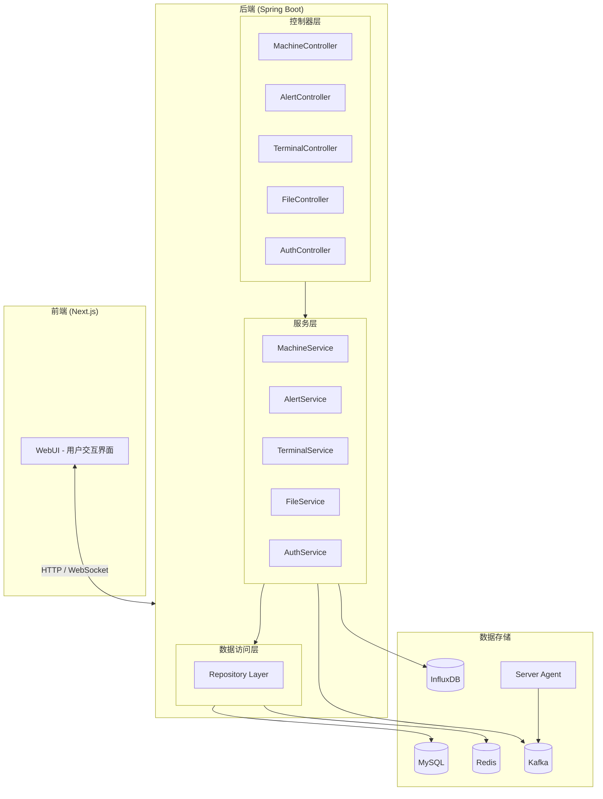
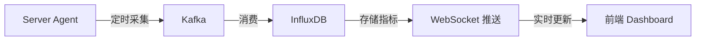

# 基于Web的服务器实时运维监控平台设计与实现

BeEyes: 新一代 Web 服务器全景式实时监控平台

<BarBottom  title="2026年4月11日">
  <Item text="指导老师: 彭露">
  </Item>
  <Item text="答辩学生: 牟俊洁">
  </Item>
</BarBottom>

---

layout: quote
transition: slide-left

---

# 目录

- 选题的背景和意义
- 项目概述
- 系统架构设计
- 核心功能实现
- 系统测试与优化
- 项目总结与展望

---

layout: quote
transition: slide-up

---

# 选题的背景和意义

---

# 选题的背景和意义

<ul>
  <li>
    随着互联网的快速发展，Web服务器成为了支撑各种在线服务的核心<span v-mark.red>基础设施</span>
  </li>
  <li>
    Vibe Coding 的迅速发展，使得技术平权，开发门槛降低。
  </li>
  <li>
    传统运维工具，Shell终端 、宝塔、1Pnael，多服务器管理难、使用门槛高。
  </li>
  <li>
    传统监控工具，如Prometheus、Grafana等，部署复杂，配置困难。
  </li>
</ul>

<!--
随着互联网的快速发展，Web服务器成为了支撑各种在线服务的核心基础设施。
- 对于非技术背景的企业，传统运维的成本问题(时间成本，人力成本)

Vibe Coding 的迅速发展，使得技术平权，开发门槛降低。
- 开发结束之后，运行的基础设施，也是服务器基础设施

传统运维工具，Shell终端 、宝塔、1Pnael，多服务器管理难、使用门槛高。
- 缺少监控功能，无法实时监控服务器状态，无法及时发现和解决问题。
-->

---

# 选题的背景和意义

目前市面上是缺少一个基于Web的服务器实时运维监控平台，能够满足企业对服务器的监控和管理需求。

- 实时监控服务器状态，及时发现和解决问题。
- 多服务器管理，方便企业对多个服务器进行统一管理和监控。
- 配置简单，无需复杂的配置和安装。
- 功能完善，包括服务器监控、性能监控、日志监控等。
- 可扩展性好，能够根据企业的需求进行扩展和定制。
- 安全可靠，能够保护企业的数据和系统安全。

---

---

# 项目概述

BeEyes 是一款面向企业的 Web 服务器实时运维监控平台

**核心特性:**

<ul>
  <li>
    <span v-mark.blue>实时监控</span> - CPU、内存、磁盘、网络等系统指标秒级采集
  </li>
  <li>
    <span v-mark.green>告警管理</span> - 灵活规则配置，支持多种告警通道
  </li>
  <li>
    <span v-mark.yellow>远程终端</span> - WebSSH 无需配置，开箱即用
  </li>
  <li>
    <span v-mark.purple>文件管理</span> - SFTP 可视化传输，批量操作
  </li>
  <li>
    <span v-mark.red>多服务器</span> - 统一管理，状态一目了然
  </li>
</ul>

---

layout: image-x
image: <https://img.beriholic.cv/%E6%88%AA%E5%B1%8F2025-11-21%2018.52.10.png>

---

## layout: quote

# 系统架构设计

---

# 系统架构设计

## 技术架构



---

# 系统架构设计

## 模块划分

| 模块                                | 功能描述             | 技术实现                 |
| ----------------------------------- | -------------------- | ------------------------ |
| <span v-mark.blue>监控模块</span>   | 服务器指标采集与存储 | Agent + Kafka + InfluxDB |
| <span v-mark.green>告警模块</span>  | 规则引擎 + 告警触发  | 定时任务 + WebSocket     |
| <span v.mark.yellow>终端模块</span> | WebSSH 远程连接      | SockJS + xterm.js        |
| <span v.mark.purple>文件模块</span> | SFTP 可视化管理      | Apache MINA SSHD         |
| <span v.mark.red>认证模块</span>    | 权限管理与Token      | SaToken                  |

---

## layout: quote

# 核心功能实现

---

# 核心功能实现

## 1. 服务器实时监控

**指标采集流程:**



**监控指标:**

<ul>
  <li>
    <span v-mark.red>CPU</span> - 使用率、负载、核心数
  </li>
  <li>
    <span v-mark.blue>内存</span> - 已用/可用/缓存
  </li>
  <li>
    <span v.mark.green>磁盘</span> - 分区使用率、IO读写
  </li>
  <li>
    <span v.mark.yellow>网络</span> - 网卡流量、连接数
  </li>
  <li>
    <span v.mark.purple>进程</span> - Top进程、资源占用
  </li>
</ul>

---

# 核心功能实现

## 2. 告警管理与日志

**告警规则配置:**

```java
// 告警规则示例
AlertRule rule = AlertRule.builder()
    .name("CPU告警")
    .metric("cpu_usage")
    .operator(">")
    .threshold(80.0)
    .duration(60)  // 持续60秒
    .level("WARNING")
    .build();
```

**告警通道:**

- <span v.mark.blue>站内通知</span> - WebSocket实时推送
- <span v.mark.green>邮件通知</span> - SMTP发送
- <span v.mark.yellow>Webhook</span> - 回调外部系统

---

# 核心功能实现

## 3. WebSocket 实时推送

```java
// 服务端推送示例
@Service
public class WebSocketService {
    @Autowired
    private SimpMessagingTemplate messagingTemplate;

    public void pushServerStatus(ServerStatusDTO status) {
        messagingTemplate.convertAndSend(
            "/topic/server/" + status.getServerId(),
            status
        );
    }
}
```

**应用场景:**

- 服务器状态变更实时通知
- 告警信息即时推送
- 监控数据实时更新

---

# 核心功能实现

## 4. SSH 终端模块

**技术实现:**

| 组件             | 作用              |
| ---------------- | ----------------- |
| SockJS           | WebSocket降级方案 |
| xterm.js         | 终端模拟器        |
| Apache MINA SSHD | SSH服务端         |
| WebShell Session | 会话管理          |

**功能特点:**

- <span v.mark.blue>无需插件</span> - 浏览器直接访问
- <span v.mark.green>多会话</span> - 支持多个终端标签
- <span v.mark.yellow>会话保持</span> - 意外断连可恢复

---

# 核心功能实现

## 5. SFTP 文件管理

**核心功能:**

<ul>
  <li>
    <span v.mark.blue>目录浏览</span> - 树形结构展示
  </li>
  <li>
    <span v.mark.green>文件上传/下载</span> - 拖拽操作
  </li>
  <li>
    <span v.mark.yellow>文件编辑</span> - 在线文本编辑
  </li>
  <li>
    <span v.mark.red>批量操作</span> - 多选批量传输
  </li>
  <li>
    <span v.mark.purple>权限预览</span> - 显示文件权限和所有者
  </li>
</ul>

---

## layout: quote

# 系统测试与优化

---

# 系统测试与优化

## 测试策略

| 测试类型                           | 覆盖范围          | 工具             |
| ---------------------------------- | ----------------- | ---------------- |
| <span v.mark.blue>单元测试</span>  | Service层业务逻辑 | JUnit5 + Mockito |
| <span v.mark.green>集成测试</span> | Controller API    | Spring Test      |
| <span v.mark.yellow>E2E测试</span> | 关键用户流程      | Playwright       |

---

# 系统测试与优化

## 性能优化

**1. Redis缓存优化**

```java
// 热点数据缓存
@Cacheable(value = "machine:list", key = "#userId")
public List<MachineView> getMachineList(Long userId) {
    return machineRepository.findByUserId(userId);
}
```

**2. Kafka异步处理**

- 指标数据异步写入，避免阻塞
- 消费者批量处理，提升吞吐量

**3. 数据库优化**

- 索引优化: 查询性能提升 10x
- 分页查询: 避免全表扫描

---

## layout: quote

# 项目总结与展望

---

# 项目总结与展望

## 项目成果

<ul>
  <li>
    <span v.mark.blue>功能完善</span> - 监控、告警、终端、文件四大核心模块
  </li>
  <li>
    <span v.mark.green>实时性强</span> - WebSocket秒级推送
  </li>
  <li>
    <span v.mark.yellow>用户体验</span> - B/S架构，开箱即用
  </li>
  <li>
    <span v.mark.red>可扩展性</span> - 模块化设计，易于扩展
  </li>
</ul>

---

# 项目总结与展望

## 未来展望

<ul>
  <li>
    <span v-mark.blue>容器监控</span> - 支持Docker、Kubernetes集群
  </li>
  <li>
    <span v-mark.green>日志分析</span> - ELK集成，日志检索
  </li>
  <li>
    <span v-mark.yellow>智能告警</span> - AI异常检测，减少误报
  </li>
  <li>
    <span v.mark.purple>移动端</span> - 小程序/APP随时监控
  </li>
</ul>

---

layout: image-x
image: <https://img.beriholic.cv/QQ%E6%88%AA%E5%9B%BE20250410114531.png>

---

<BarBottom  title="感谢聆听">
  <Item text="指导老师: 彭露">
  </Item>
  <Item text="答辩学生: 牟俊洁">
  </Item>
</BarBottom>
